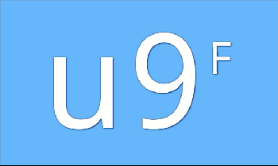

# ReBase60 Clock

## Introduction

ReBase60 Clock is a clock face that uses ReBase60 encoding to present time - the kind of presentation that is efficient from both written and spoken point of view.

It takes a bit of practice to learn the mapping but, after a couple of days, one should be able to tell time at a glance.

## Examples

Instead of *\"I'll meet you at **twelve o'clock**\"*, one would say *\"I'll meet you at **l**\"*.

*\"Let's get this done by **seven thirty PM**\"* becomes *\"Let's get this done by **g 5**\"*.

*\"The seminar starts at **eight forty-five**\"* is written as *\"The seminar starts at **h O**\"*, and spoken as *\"The seminar starts at **h o-upper**\"*.

## ReBase60 Encoding

ReBase60 stands for **Rearranged Base 60** and is a way to encode a number from zero to 59 as a single character - a ReBase60 digit.

The encoding is designed in a way that tries to reuse common understanding about digits and letters, particularly their ordering. In addition, digits are intentionally used near the end of a half-cycle and the end of a cycle, and at their beginnings.

It uses 10 decimal digits, 25 lowercase Latin letters and 25 uppercase Latin letters.

| Decimal | ReBase60 | Comment |
| ------- | -------- | ------- |
| 0       | 0        | Zero stays zero. |
| 1       | a        | First, lowercase letters from **a** to **y** get used up. |
| 2       | b        |
| 3       | c        |
| 4       | d        |
| 5       | e        |
| 6       | f        |
| 7       | g        |
| 8       | h        |
| 9       | i        |
| 10      | j        |
| 11      | k        |
| 12      | l        |
| 13      | m        |
| 14      | n        |
| 15      | o        |
| 16      | p        |
| 17      | q        |
| 18      | r        |
| 19      | s        |
| 20      | t        |
| 21      | u        |
| 22      | v        |
| 23      | w        |
| 24      | x        |
| 25      | y        |
| 26      | 1        | Switching back to decimal digits, as we're approaching the middle of a cycle, and the start of a new half-cycle. |
| 27      | 2        |
| 28      | 3        |
| 29      | 4        |
| 30      | 5        | **5** means we're right in the middle of a cycle, as in the decimal system. |
| 31      | A        | Then, uppercase letters from **A** to **Z** follow. |
| 32      | B        |
| 33      | C        |
| 34      | D        |
| 35      | E        |
| 36      | F        |
| 37      | G        |
| 38      | H        |
| 39      | I        |
| 40      | J        |
| 41      | K        |
| 42      | L        |
| 43      | M        |
| 44      | N        |
| 45      | O        |
| 46      | P        |
| 47      | Q        |
| 48      | R        |
| 49      | S        |
| 50      | T        |
| 51      | U        |
| 52      | V        |
| 53      | W        |
| 54      | X        |
| 55      | Y        |
| 56      | 6        | Switching back to decimal digits, again, as we're approaching the end of a cycle, and the start of a new cycle. |
| 57      | 7        |
| 58      | 8        |
| 59      | 9        | **9** is the last one in a cycle, as in the decimal system. |

## Additional Features

The clock face showcases a couple of experimental features.

### All Uppercase

An alternative display mode that uses uppercase letters only and underlines them in the second half of a cycle.

(You can use **24-hour format** switch in clock settings, to shift between **standard** and **uppercase** display modes.)

### Thermometer

The vertical position of the seconds digit maps to temperature, as reported by the clock. When positioned in the middle of the screen, it means that the temperature is 0°C (32°F). When on the top, the temperature is 50°C (122°F) or above. When on the bottom, the temperature is -50°C (-58°F) or below.

These limitations render the thermometer (almost) useless in extreme conditions, but in those conditions getting an accurate temperature reading would probably end up among the least of your problems.

### Weather

Color scheme maps roughly to the weather condition that is reported by the clock. Thus far, **sunny** and **snowy** weather conditions have been covered, with all others defaulting to a gray-ish kind of scheme.

### Dark Theme

A dark color scheme is calculated based on its light-colored counterpart.

